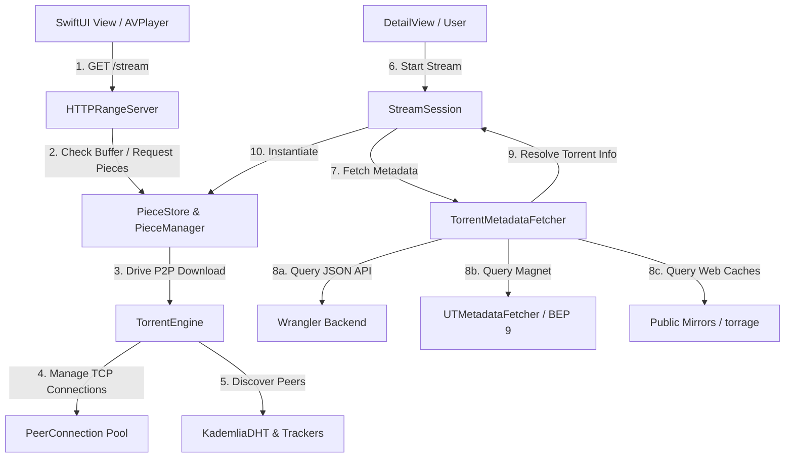

# MovieBox Torrent Streaming Architecture & Playback Pipeline Walkthrough
## Knowledge Transfer (KT) Document

This document provides a highly comprehensive, line-by-line, and component-by-component architectural breakdown of the **MovieBox** client-side BitTorrent streaming engine (`CoreStreaming`). It is designed for engineers, developers, and architects who need to understand how metadata is resolved, how the torrent peer-to-peer download system operates, and how playback range requests are served dynamically to the media player in real-time.

**Full verbatim source dumps** (no truncation) for the playback pipeline live in [.agents/KT-source-appendix.md](.agents/KT-source-appendix.md). The longer wire-protocol KT is [.agents/KT.md](.agents/KT.md).

---

## 1. High-Level Architecture Overview

MovieBox is a specialized BitTorrent client optimized for real-time video streaming. Unlike traditional torrent clients that download pieces in a randomized or rarest-first order to maximize swarm availability, MovieBox utilizes a custom-built, progressive streaming engine. This engine prioritizes the pieces of the file required for active media playback, starting with the file headers, proceeding with the tail index pieces (for container formats like MP4/MKV), and then fulfilling progressive read requests from the player.

### System Topology Diagram

The diagram below outlines the core modules of the MovieBox codebase and their interactions:



### Module Descriptions

1.  **MovieBox Core / UI**: The SwiftUI player interface triggers the streaming sequence. It holds a `@Published` reference to the `StreamSession` to display the loading state, download speed, connected peers, and buffer progress.
2.  **StreamSession**: Manages the playback session state machine (`.idle`, `.preparing`, `.buffering`, `.ready`, `.failed`, `.cancelled`). It wraps the streaming orchestrator, starts the buffering watchdog, and updates playback metrics at a regular interval (300ms).
3.  **StreamingOrchestrator**: The central controller that implements `StreamingOrchestration`. It acts as the glue code between the low-level BitTorrent protocol features and the HTTP playback interface.
4.  **TorrentMetadataFetcher**: A parallel group of fetchers that resolves the magnet link or info hash into a parsed `TorrentMetadata` struct. It queries a custom Wrangler Cloudflare worker backend, public torrent cache mirrors, and BitTorrent peers via BEP 9 (Metadata Exchange).
5.  **HTTPRangeServer**: A lightweight TCP listener that implements a subset of the HTTP/1.1 protocol. It intercepts range requests (`Range: bytes=X-Y`) sent by Apple's `AVPlayer` and serves them from local storage once the corresponding torrent pieces are downloaded and verified.
6.  **PieceStore**: The storage actor. It allocates the sparse media files on disk, tracks which torrent pieces have been downloaded and verified via a Bitfield bitmap, caches write blocks in memory, and blocks player reads until the requested data becomes available.
7.  **PieceManager**: The prioritization actor. It maintains the torrent's piece prioritization queue. It implements a hybrid rarest-first and stream-sequential piece picker. It tracks which pieces are currently requested, verified, or rejected, and updates priority based on player read behavior.
8.  **TorrentEngine**: The core BitTorrent controller. It coordinates UDP/HTTP tracker announces, initiates Kademlia DHT crawls, maintains a pool of active TCP peer connections, and manages download speed estimation.
9.  **PeerConnection**: Represents a single peer TCP socket connection. It handles the BitTorrent protocol wire framing (Handshake, Keep-Alive, Bitfield, Have, Request, Piece, Cancel) using the Apple `Network` framework (`NWConnection`).

---

## 2. The Metadata Resolution Pipeline

To stream a torrent, the client must first obtain the `.torrent` metadata file (the `info` dictionary). This dictionary contains crucial structure:
-   **Piece Length**: Typically 16 KB up to 32 MB, specifying the size of each block verified by SHA-1.
-   **Pieces Hash Map**: A concatenated string of 20-byte SHA-1 hashes (one hash per piece).
-   **File Layout**: Names, relative paths, and sizes of all files contained within the torrent.

Without this metadata, the client cannot request specific block indices from peers, nor can it know where the media file begins or ends. The metadata acquisition pipeline is orchestrated by the `TorrentMetadataFetcher` inside [TorrentMetadataFetcher.swift](file:///Users/marban/Documents/Coding/moviebox/App/CoreStreaming/Sources/CoreStreaming/TorrentMetadataFetcher.swift).

### Parallel Fetching Sequence

When the user initiates a stream, `TorrentMetadataFetcher.fetch(infoHash:magnetTrackers:)` is called. To minimize startup latency, it constructs a `withThrowingTaskGroup` that launches three concurrent tasks:

```
TorrentMetadataFetcher.fetch()
  |
  +-- Task 1 (12s Timeout): Fetch Torrent Bytes from custom Wrangler Backend
  |
  +-- Task 2 (15s Timeout): Download Torrent from Web Mirrors (itorrents, torrage, codetabs)
  |
  +-- Task 3 (35s Timeout): Fetch Metadata from Swarm Peers (UTMetadataFetcher / BEP 9)
```

The first task to succeed returns its `TorrentMetadata` structure, cancelling the other two outstanding tasks.

### 2.1 Backend HTTP Resolution

If a custom worker backend is configured, the client attempts to fetch the `.torrent` file directly from a centralized database or caching proxy. This is the fastest resolution method, typically resolving in under 1 second.
1.  **Request Formulation**: The helper `fetchTorrentBytesFromBackend(hash:config:)` constructs an HTTP GET request to the worker's `/metadata` endpoint.
2.  **Authorization**: It attaches a header `X-MovieBox-Token` to authenticate with the backend.
3.  **Validation**: It inspects the HTTP response code (must be `200 OK`) and checks if the body starts with the byte `0x64` (ASCII 'd'), which represents the start of a bencoded dictionary. If the backend returns a JSON payload (e.g., beginning with `0x7B` '{'), it indicates an API error and the backend fetch is failed.

### 2.2 Public Torrent Mirrors (Caches)

If the custom backend is offline or has not cached the requested torrent, the mirror crawler task (`fetchFirstMirror`) runs in parallel.
1.  It iterates over a list of known torrent mirrors:
    -   `http://torrage.info/torrent.php?h={infoHash}`
    -   `https://itorrents.org/torrent/{infoHash}.torrent`
    -   `https://api.codetabs.com/v1/proxy/?quest=https://itorrents.org/torrent/{infoHash}.torrent`
2.  **Proxy Bypass**: To bypass school, corporate, or ISP-level SNI domain blocks, the fetcher routes requests through the `codetabs.com` CORS/HTTPS proxy.
3.  **Parallel Execution**: It executes requests to all mirrors concurrently in a nested task group, returning the first one to resolve with valid torrent data.

### 2.3 Peer-to-Peer Metadata Exchange (BEP 9 / `ut_metadata`)

When web caches fail, the engine falls back to P2P metadata resolution. This is managed by `UTMetadataFetcher` inside [UTMetadataFetcher.swift](file:///Users/marban/Documents/Coding/moviebox/App/CoreStreaming/Sources/CoreStreaming/UTMetadataFetcher.swift).

The P2P metadata exchange flow follows these steps:

#### Step 1: Tracker Peer Discovery
To fetch metadata from peers, the client must find active peers. It announces to up to 25 UDP and HTTP trackers in parallel.
-   **Announce URL Filtering**: It groups and prioritizes trackers, starting with `udp://` followed by `http://` and `https://` URLs.
-   **Announce Payload**: It submits a tracker announce with `left = 1` and `event = .started`. It specifies `numWant = 80` to request a large list of peers.
-   **UDP Announce**: Formats raw UDP packets containing the connection ID, action ID (1 for announce), transaction ID, info hash, peer ID, port (6881), and state flags.

#### Step 2: Protocol Handshake & Extension Negotiation
Once peers are discovered, the fetcher attempts to connect to up to 6 peers concurrently. It establishes a TCP socket using Apple's `Network` framework.
-   **TCP Handshake**: Initiates the TCP connection. The connection timeout is set to 5 seconds.
-   **BitTorrent Handshake**: Immediately upon TCP connection, the client sends a 68-byte BitTorrent handshake packet:
    ```
    Offset 0: Protocol string length (19)
    Offset 1-19: Protocol identifier string ("BitTorrent protocol")
    Offset 20-27: Extension handshake flags (Byte 5 is set to 0x10 to declare support for BEP 10 Extended Messages)
    Offset 28-47: Info Hash (20 bytes)
    Offset 48-67: Peer ID (20 bytes)
    ```
-   **Handshake Verification**: The client reads the first 68 bytes returned by the peer. It verifies the protocol string and inspects byte 25. If the peer does not support extended messages, the connection is dropped.

#### Step 3: Extended Handshake
The client transmits an Extended Handshake message (message ID 20, extended ID 0) containing a bencoded dictionary:
```json
{
  "m": {
    "ut_metadata": 1
  },
  "reqq": 255
}
```
This tells the peer that MovieBox associates the extension name `ut_metadata` with the local ID `1` (which is standard).
-   **Reading Peer's Extended Handshake**: The client waits for the peer's corresponding extended message. It parses the incoming packet's bencoded payload.
-   **ut_metadata Mapping**: It reads the peer's mapping for `ut_metadata` (e.g. `"ut_metadata": 2`). This maps the peer's custom extended ID for metadata exchange.
-   **Metadata Size**: It reads the `"metadata_size"` key, which indicates the total byte length of the bencoded `info` dictionary of the torrent.

#### Step 4: Metadata Piece Downloading
BitTorrent metadata exchange breaks the `info` dictionary into 16 KB pieces.
-   **Piece Count Calculation**: Let `N = (metadata_size + 16383) / 16384`.
-   **Requesting Pieces**: The client sends a bencoded request for each metadata piece sequentially:
    ```json
    {
      "msg_type": 0,
      "piece": 0
    }
    ```
    This dictionary is bencoded and sent inside an extended message packet (message ID 20, extended ID matching the peer's `ut_metadata` ID).
-   **Receiving Data**: The peer responds with a packet of type `"msg_type": 1` (data), containing the piece index, and the raw binary bytes of the metadata block appended to the end of the bencoded dictionary header.
-   **Assembly & Hash Verification**: The client concatenates the 16 KB pieces. Once all pieces are downloaded, it computes the SHA-1 hash of the assembled data. If it matches the original info hash, the bencoded `info` dictionary is successfully parsed and returned as `TorrentMetadata`.

---

## 3. Torrent Engine & P2P Orchestration

Once `TorrentMetadata` is resolved, `StreamingOrchestrator` prepares the workspace for streaming.

```
StreamingOrchestrator.startStream()
  |
  +-- Select Primary File Target (largest video file)
  +-- Compute Piece Layout (start/end pieces overlapping the file)
  +-- Compute Tail Pieces (indices for container index resolution)
  +-- Instantiate PieceStore & PieceManager
  +-- Instantiate TorrentEngine
  +-- Start Tracker/DHT Discovery Loops
  +-- Start HTTPRangeServer
```

The orchestrator chooses the primary file to stream (typically the largest video file in the torrent), and instantiates the storage and priority systems.

### 3.1 Piece Allocation & Storage (`PieceStore`)

The `PieceStore` (in [PieceStore.swift](file:///Users/marban/Documents/Coding/moviebox/App/CoreStreaming/Sources/CoreStreaming/PieceStore.swift)) manages the physical file on disk.
-   **Sparse File Allocation**: To avoid taking minutes to allocate multi-gigabyte video files on mobile flash storage, `PieceStore` initializes a sparse file in the temporary directory. It opens a write handle and calls `try handle.truncate(atOffset: UInt64(totalSize))`. The OS allocates metadata blocks, leaving the actual data blocks empty (filled with zeroes on demand).
-   **Bitmap Serialization**: It maintains a bitmap array (`[Bool]`) of size `pieceCount`. This bitmap is serialized to disk as a `.bitmap` file using bit-packing (8 pieces per byte). This allows streaming sessions to resume across application restarts without re-downloading already completed pieces.
-   **Memory-Buffered Disk Writes**: To prevent excessive write-seeking, `PieceStore` implements a write cache. Incoming blocks from peers are appended to a `CachedBlock` queue in memory. When the queue size reaches `maxCacheSize` (2 MB), the store flushes the blocks to disk in order.

### 3.2 Prioritization (`PieceManager`)

The `PieceManager` (in [PieceManager.swift](file:///Users/marban/Documents/Coding/moviebox/App/CoreStreaming/Sources/CoreStreaming/PieceManager.swift)) handles piece selection. Standard torrent clients download pieces in a "rarest-first" sequence to distribute blocks evenly across the swarm. MovieBox overrides this to prioritize streaming playback.

#### Playback Priority States

The `PieceManager` enforces two sequential download phases:

##### 1. Index Bootstrap Phase (Loading/Buffering)
Before media playback can start, the video player needs to parse the file container's metadata index. For MP4 files, this is the `moov` atom. For MKV files, these are the index cues.
-   **Stream First Piece**: Prioritizes the first piece of the video file (index `streamFirstPiece`).
-   **Stream Tail Pieces**: Prioritizes the last pieces of the video file (indices `streamTailPieces`), as the index is usually located at the end of the file.
-   **Restriction**: As long as the head piece or any tail pieces are incomplete (`needsIndexBootstrap() == true`), the picker will *never* request other parts of the video file.

##### 2. Playback Phase (Streaming)
Once the index is resolved and the player begins reading data:
-   **Player Hot Pieces**: The HTTP range server reports which byte range the player is reading. `PieceManager.notePlayerRead(mediaOffset:length:)` maps these bytes to torrent piece indices.
-   **Read-Ahead Buffer**: The pieces containing the player's current read cursor, along with a read-ahead window of `readAheadPieceCount` (3 pieces), are given highest priority.
-   **Sequential Buffer**: If the player is caught up, the engine downloads pieces sequentially starting from the current playback position.

```
Torrent Pieces Priority Queue:
[ High Priority: Hot Pieces ] -> [ Medium Priority: First Piece + Tail Pieces ] -> [ Low Priority: Sequential Next Pieces ]
```

### 3.3 Network Management (`TorrentEngine`)

The `TorrentEngine` (in [StreamingOrchestrator.swift](file:///Users/marban/Documents/Coding/moviebox/App/CoreStreaming/Sources/CoreStreaming/StreamingOrchestrator.swift) at line 585) handles peer connections and tracking.
-   **Kademlia DHT Node**: Starts an internal Kademlia DHT node (`KademliaDHT.swift`). It announces the info hash to discover peers in the DHT routing table without relying on centralized trackers.
-   **Tracker Announce Loop**: Spawns a background task that re-announces to HTTP/UDP trackers every 60 seconds to refresh the peer pool.
-   **Peer Pruning**: A periodic maintenance timer runs every 10 seconds to clean up dead or slow peer connections:
    -   Disconnects socket connections in `.disconnected` or `.error` states.
    -   Disconnects connections stuck in the handshake phase for more than 25 seconds.
    -   Disconnects peers that have been choked for more than 60 seconds without contributing data, freeing slots for new peer connections (capped at `maxPeerConnections = 64`).

### 3.4 Wire Protocol Implementation (`PeerConnection`)

Each peer is wrapped in a `PeerConnection` instance (in [PeerConnection.swift](file:///Users/marban/Documents/Coding/moviebox/App/CoreStreaming/Sources/CoreStreaming/PeerConnection.swift)). This class executes the BitTorrent protocol over a raw TCP socket:

-   **Message Framing**: Packets are read with a 4-byte big-endian length prefix. The engine parses message IDs to route payloads:
    ```
    ID 0: Choke
    ID 1: Unchoke
    ID 2: Interested
    ID 3: Not Interested
    ID 4: Have
    ID 5: Bitfield
    ID 6: Request (request block: 4-byte piece index, 4-byte block offset, 4-byte block length)
    ID 7: Piece (contains raw data block payload)
    ID 8: Cancel (retracts a block request)
    ```
-   **Request Pipelining**: To maximize throughput, the client pipelines block requests. Rather than waiting for a block to arrive before requesting the next one, it maintains multiple outstanding requests (typically up to 5-15 requests in flight per peer connection) depending on the connection speed.
-   **Request Timeout Expiration**: If a peer does not respond to a block request within 15 seconds, the request is marked as expired, and is reassigned to another peer.

---

## 4. Playback Integration & HTTP Range Server

To play the torrent stream using Apple's native `AVPlayer`, MovieBox runs a local HTTP loopback server (`HTTPRangeServer` inside [HTTPRangeServer.swift](file:///Users/marban/Documents/Coding/moviebox/App/CoreStreaming/Sources/CoreStreaming/HTTPRangeServer.swift)). Apple's `AVPlayer` is passed a local loopback URL (e.g., `http://127.0.0.1:PORT/stream`).

```
AVPlayer                     HTTPRangeServer                  PieceStore / PieceManager
    |                                |                                   |
    |------ GET /stream ------------>|                                   |
    |   (Range: bytes=0-1048575)     |                                   |
    |                                |------ Check Readability --------->|
    |                                |       (Wait for Piece/Head)       |
    |                                |<----- Data Available -------------|
    |<----- 206 Partial Content -----|                                   |
    |       (Serve Bytes)            |                                   |
```

### 4.1 Serving Range Requests

Apple's `AVPlayer` uses HTTP range requests (`Range: bytes=start-end`) to stream media. It reads the file header first, seeks to the end of the file to inspect the index metadata, and then requests sequential chunks of the video data.

1.  **Host Headers Validation**: For security, the server rejects requests if the HTTP `Host` header does not resolve to `127.0.0.1` or `localhost`. This prevents DNS rebinding attacks.
2.  **Range Header Parsing**: The server parses the HTTP request headers.
    -   If it parses `Range: bytes=0-`, it indicates an open-ended request from the start of the file.
    -   If it parses `Range: bytes=-524288`, it indicates a suffix range request for the last 512 KB of the file.
3.  **Request Capping**: To prevent `AVPlayer` from failing due to oversized buffers, the range server caps response lengths to `maxRangeBytes` (2 MB).
4.  **Buffer Wait & Block**: When a range request arrives:
    -   The server converts the requested media offset to a torrent file offset.
    -   It calls `PieceStore.readableSpan(offset:length:preferSuffix:)`.
    -   If the requested byte range is not yet downloaded, the handler suspends inside a loop, waiting for the pieces to be verified (up to `bufferWaitSeconds = 300` seconds).
    -   Once the pieces are downloaded and flushed to disk, the range server reads the data from disk and returns an HTTP `206 Partial Content` response.
    -   If the download stalls and exceeds the timeout limit, the server returns HTTP `503 Service Unavailable` with a `Retry-After` header, prompting the player to retry the request shortly.

### 4.2 Stream Tail Probing & Media Initialization

Container formats like MP4 require the player to read the container's structural index (the `moov` atom) before it can initialize the video and audio decoders. 
-   **Fast-Start MP4s**: If the video is structured with the `moov` atom at the beginning of the file (before the `mdat` video payload), `StreamTailPlanner.isFastStartMP4(in:)` parses the container boxes in the head piece. If it finds the `moov` atom, it marks the stream as ready immediately. Playback starts in under a second.
-   **Standard MP4 / MKV**: In most torrents, the index is located at the end of the file. The player cannot start playback without downloading the tail pieces.

#### How Tail Probing Works

The client determines if tail probing is complete via `isStreamTailPieceReady()` inside `StreamingOrchestrator.swift`.

##### 1. Suffix Read Sizing
It calculates a `tailSpan` (usually 8 MB to 32 MB depending on the video file size) to locate the index.
-   `fileEnd = target.byteOffset + target.byteLength`
-   `tailStart = max(target.byteOffset, fileEnd - tailSpan)`

##### 2. Suffix Contiguity Probing (Contiguous Tail Probe Optimization)
The engine locates the last piece of the movie (`lastPiece`). If the last piece is verified:
-   It walks backwards from `lastPiece` towards `tailStart`.
-   It finds the contiguous block of downloaded pieces ending at `lastPiece`.
-   It computes `startOffset` as the beginning of this contiguous verified range.
-   It reads the data from `startOffset` to `fileEnd` from the `PieceStore`.
-   **Key Optimization**: The engine does not wait for the entire `tailSpan` to be fully downloaded. It reads the largest contiguous range of verified pieces at the end of the file. If the `moov` atom is fully contained within this range, the probe succeeds. Playback starts immediately, avoiding stalls due to slow or missing pieces in the middle of the tail span.

##### 3. index Box Analysis (`moovTailProbe`)
`StreamTailPlanner.moovTailProbe` parses the read tail buffer:
-   It scans the byte stream for the ASCII signature `"moov"`.
-   It extracts the box size (4 bytes or 8 bytes if large).
-   It checks if the entire box is within the downloaded buffer boundaries:
    -   `complete`: The entire `moov` index is downloaded. Playback is ready.
    -   `incomplete`: The `moov` signature is present but the box size extends past the downloaded data boundary. The engine continues downloading preceding tail pieces.
    -   `notFound`: The `moov` box was not found in the read buffer. The engine falls back to verifying that at least a minimum portion of the tail pieces (e.g., 2 or more pieces) are downloaded before starting playback.

---

## 5. Architectural Breakdown of Source Files

This section catalogs every source file inside the `CoreStreaming` module, detailing its role, structural properties, and key methods.

### 5.1 [StreamSession.swift](file:///Users/marban/Documents/Coding/moviebox/App/CoreStreaming/Sources/CoreStreaming/StreamSession.swift)
-   **Role**: Main thread coordinator and observable API for the UI player. It implements the state machine and publishes speed, buffering, and connection states to views.
-   **State Machine Enums**:
    -   `.idle`: Initial unstarted state.
    -   `.preparing`: Resolving torrent metadata and allocating storage.
    -   `.buffering(progress: Double)`: Actively downloading the first and tail pieces of the media file.
    -   `.ready(streamURL: URL)`: Local HTTP server is ready, tail probe was successful, and player can connect.
    -   `.failed(error: String)`: Streaming failure with detailed, speed-aware watchdog crash reasons.
    -   `.cancelled`: The user stopped streaming.
-   **Key Methods**:
    -   `start(torrent:)`: Resets the session state, initializes task groups, triggers the `StreamingOrchestrator` startup, and spawns the monitoring and buffering watchdog loops.
    -   `startMonitoring()`: A cyclic loop executing every 300ms. It aggregates current piece completion statistics, active TCP peer metrics, and rolling average download speeds.
    -   `startBufferingWatchdog()`: Standard watchdog routine. Runs every 5s. Evaluates if the current state remains stuck in `.preparing` or `.buffering`. If the verified bytes or transferring peers are 0, and the download speed drops to 0, it counts down until the timeout limit (180s - 300s) is hit and then throws an error.
    -   `cancel()`: Stops all asynchronous loops, clears state references, and invokes orchestrator termination.

### 5.2 [StreamingOrchestrator.swift](file:///Users/marban/Documents/Coding/moviebox/App/CoreStreaming/Sources/CoreStreaming/StreamingOrchestrator.swift)
-   **Role**: The coordinator linking the BitTorrent protocol wire engine, the file store actor, and the local HTTP loopback server.
-   **Key Structures**:
    -   `StreamingOrchestrator`: The primary class implementing the `StreamingOrchestration` protocol.
-   **Core Algorithms**:
    -   `startStream(torrent:progressHandler:)`: Entry point. Triggers parallel metadata crawler tasks. Once metadata is received, maps files, chooses the largest file target matching common media extensions (mp4, mkv, avi, mp3, etc.), instantiates `PieceStore` and `PieceManager`, starts `HTTPRangeServer`, and boots `TorrentEngine`.
    -   `readVerifiedTailWindow(...)`: Reads the contiguous tail pieces from the back of the target video file. Walks from the last piece index backwards until a missing piece or the beginning of the tail window is hit, then extracts this contiguous byte span.
    -   `isStreamTailPieceReady()`: Runs the MP4/MKV index parser. If a fast-start MP4 is detected via `isFastStartMP4`, skips tail checks and returns `true`. Otherwise, performs the contiguous tail-probe on verified suffix data.

### 5.3 [HTTPRangeServer.swift](file:///Users/marban/Documents/Coding/moviebox/App/CoreStreaming/Sources/CoreStreaming/HTTPRangeServer.swift)
-   **Role**: Lightweight TCP listener that accepts local socket connections from `AVPlayer`, parses HTTP GET requests, and responds with partial byte streams.
-   **Key Fields**:
    -   `listener`: Network framework `NWListener` configured for TCP.
    -   `port`: The local port assigned during server initialization.
    -   `maxRangeBytes`: Limit set to 2 MB to prevent buffer overflow inside iOS media frameworks.
-   **Core Processing**:
    -   `receiveHTTPRequest(...)`: Reads raw bytes from the client socket. It accumulates data and scans for the double carriage-return line-feed (`\r\n\r\n`) representing the boundary of HTTP headers.
    -   `handleRequest(...)`: Resolves the range parameters (e.g. `Range: bytes=5000-10000`). Translates this client request to absolute storage offsets, maps it to the primary video file target bounds, calls `PieceStore.readableSpan()`, and blocks until the data is available. Once read, responds with HTTP/1.1 headers:
        ```http
        HTTP/1.1 206 Partial Content
        Content-Range: bytes X-Y/Z
        Content-Length: L
        Content-Type: video/mp4
        Connection: keep-alive
        ```

### 5.4 [PieceStore.swift](file:///Users/marban/Documents/Coding/moviebox/App/CoreStreaming/Sources/CoreStreaming/PieceStore.swift)
-   **Role**: Isolated Actor managing physical disk storage, in-memory block caching, bitfield bitmap serialization, and thread blocking for pending range reads.
-   **Properties**:
    -   `bitmap`: Array of booleans of length equal to torrent piece count.
    -   `writeHandle`, `readHandle`: Native Swift `FileHandle` wrappers pointing to the file.
    -   `cachedBlocks`: Array of cached blocks waiting to be flushed to disk once the cache limit is exceeded.
-   **Key Methods**:
    -   `writeBlock(pieceIndex:blockOffset:data)`: Receives a downloaded block (typically 16 KB). Writes it to the in-memory write-cache. If the cache exceeds 2 MB, flushes it to disk at the calculated absolute byte offsets.
    -   `readableSpan(offset:length:preferSuffix:)`: Scans the piece bitmap to identify how much of the requested range is currently verified on disk. If the range has missing blocks, it yields the current task and blocks.
    -   `waitForReadable(offset:length:)`: Suspends the caller using task-suspension and polls every 100ms. It times out after 300 seconds if the requested range does not complete, preventing the player thread from hanging indefinitely.

### 5.5 [PieceManager.swift](file:///Users/marban/Documents/Coding/moviebox/App/CoreStreaming/Sources/CoreStreaming/PieceManager.swift)
-   **Role**: Isolated Actor managing block requests, prioritizations, hash verifications, and download states.
-   **Piece completion enum** (no `PieceState` / `PieceStatus` in this module): `PieceReceiveOutcome` — `.incomplete`, `.verified`, `.rejected`.
-   **Key Methods**:
    -   `getNextRequest(peerBitfield:)`: Uses `earliestIncompletePiece(peerBitfield:)` then next missing 16 KB block.
    -   `markBlockReceived(pieceIndex:offset:block:)`: Merges into `pieceBuffers`; on full piece runs SHA-1 verify; `.verified` adds to `downloadedPieces` (disk write via `PieceIngestion`).
    -   `notePlayerRead(mediaOffset:length:)`: Hot-pieces queue (max 32) + 3-piece read-ahead.
    -   `earliestIncompletePiece(peerBitfield:)`: Bootstrap order while first/tail pieces missing; else bootstrap + sequential.

### 5.6 [StreamTailPlanner.swift](file:///Users/marban/Documents/Coding/moviebox/App/CoreStreaming/Sources/CoreStreaming/StreamTailPlanner.swift)
-   **Role**: Container index planner. Responsible for sizing the tail window and inspecting video container box offsets.
-   **Methods**:
    -   `tailByteSpan(byteLength:pieceLength:)`: Suffix size algorithm. Sizes the tail probe window based on file scale (from a minimum of 8 MB to a maximum of 32 MB).
    -   `moovTailProbe(data:fileLength:tailStart)`: Inspects raw bytes for the presence of the `moov` atom. Returns `.complete` if found, or `.incomplete` if the atom is partially truncated.
    -   `isFastStartMP4(in:)`: Checks if the first 64 KB of the file contains the `moov` box. If it does, the index is located at the beginning of the file, allowing playback to start without downloading any tail pieces.

### 5.7 [PeerConnection.swift](file:///Users/marban/Documents/Coding/moviebox/App/CoreStreaming/Sources/CoreStreaming/PeerConnection.swift)
-   **Role**: Manages a single TCP socket connection to a peer, parses incoming protocol framing, manages chokestates, and handles block request pipelining.
-   **Key Variables**:
    -   `connection`: Apple `NWConnection` representing the socket.
    -   `chokedByPeer`, `chokingPeer`, `interestedInPeer`, `peerInterested`: Boolean wire flags.
    -   `pendingRequests`: Array of blocks requested from this peer.
-   **Wire Message Handling**:
    -   `receiveLoop()`: Reads incoming packets. Extracts the 4-byte length header, parses the 1-byte message ID, and routes the payload to the appropriate handler (e.g. `handleUnchoke`, `handlePiece`, etc.).
    -   `requestBlocks()`: Prepares a batch of requests up to the pipelining limit (usually 5-15 in flight) to keep the download pipeline full.
    -   `expireStalledRequests()`: Periodic check. Clears pending requests that have been outstanding for more than 15 seconds.

### 5.8 [UTMetadataFetcher.swift](file:///Users/marban/Documents/Coding/moviebox/App/CoreStreaming/Sources/CoreStreaming/UTMetadataFetcher.swift)
-   **Role**: Performs metadata exchange (BEP 9) with active swarm peers over extension protocol handshakes (BEP 10).
-   **Workflow**:
    -   Establishes TCP connections to peers, performs the BitTorrent handshake with the extension bit set, and exchanges extended handshakes.
    -   Determines the peer's custom `ut_metadata` extension ID mapping and the total `"metadata_size"`.
    -   Requests metadata pieces (16 KB each) sequentially using the bencoded query dictionary.
    -   Assembles the received blocks, computes the SHA-1 hash, and verifies it against the torrent's info hash.

### 5.9 [KademliaDHT.swift](file:///Users/marban/Documents/Coding/moviebox/App/CoreStreaming/Sources/CoreStreaming/KademliaDHT.swift)
-   **Role**: Manages the local Kademlia DHT node, routing table, and peer discovery.
-   **Features**:
    -   Binds a local UDP port (typically 6881) using `NWListener`.
    -   Maintains a routing table containing active DHT nodes, capped at 200 nodes.
    -   Implements `findPeers(infoHash:)` to crawl the DHT by recursively querying the closest nodes to the target hash.
    -   Registers peer tokens and handles `announce_peer` queries to announce our presence to other nodes.

### 5.10 [UDPTrackerClient.swift](file:///Users/marban/Documents/Coding/moviebox/App/CoreStreaming/Sources/CoreStreaming/UDPTrackerClient.swift)
-   **Role**: UDP tracker communication actor. Formats and parses tracker connection and announce packets.
-   **Implementation**:
    -   Implements the UDP tracker protocol (BEP 15) using raw binary serialization.
    -   Caches active tracker sessions to reuse connection IDs across announce calls.
    -   Uses a custom `UDPContinuationGate` class to safely resume network continuations across timeouts and connection states.

### 5.11 [Bencode.swift](file:///Users/marban/Documents/Coding/moviebox/App/CoreStreaming/Sources/CoreStreaming/Bencode.swift)
-   **Role**: Recursive Bencode parser and encoder.
-   **Data Model**:
    -   `BencodeValue` enum:
        -   `.string(Data)`
        -   `.integer(Int64)`
        -   `.list([BencodeValue])`
        -   `.dictionary([String: BencodeValue])`
-   **Implementation**:
    -   `parse(_:)`: Recursive descent parser that decodes raw bytes into a `BencodeValue` tree.
    -   `encode(_:)`: Serializes a `BencodeValue` tree back into bencoded binary format.

### 5.12 [DownloadManager.swift](file:///Users/marban/Documents/Coding/moviebox/App/CoreStreaming/Sources/CoreStreaming/DownloadManager.swift)
-   **Role**: Coordinates background downloads and handles download task persistence.
-   **Features**:
    -   Manages the queue of active and completed downloads.
    -   Serializes download tasks to disk to resume them across application restarts.
    -   Uses sequential downloading and piece writing similar to the streaming player, but without the live range-reading and tail-probing constraints.

### 5.13 [RemuxService.swift](file:///Users/marban/Documents/Coding/moviebox/App/CoreStreaming/Sources/CoreStreaming/RemuxService.swift)
-   **Role**: Remuxes media containers (e.g. converting MKV/AVI streams containing compatible codecs to MP4) to make them playable in native iOS players.
-   **Implementation**:
    -   Parses container structures and writes compatible streams into an MP4 wrapper on the fly.

### 5.14 [TrackerClient.swift](file:///Users/marban/Documents/Coding/moviebox/App/CoreStreaming/Sources/CoreStreaming/TrackerClient.swift)
-   **Role**: High-level HTTP and UDP tracker client manager.
-   **Implementation**:
    -   Wraps HTTP/HTTPS/UDP tracker announcers, queries tracker swarms in parallel, and returns unified peer lists.

### 5.15 [TorrentMetadata.swift](file:///Users/marban/Documents/Coding/moviebox/App/CoreStreaming/Sources/CoreStreaming/TorrentMetadata.swift)
-   **Role**: Structured model for `.torrent` files.
-   **Implementation**:
    -   Parses bencoded torrent files, extracts pieces hashes, file listings, piece length, total length, tracker lists, and info hashes.

### 5.16 [TorrentStreamTarget.swift](file:///Users/marban/Documents/Coding/moviebox/App/CoreStreaming/Sources/CoreStreaming/TorrentStreamTarget.swift)
-   **Role**: Stream file target inside a multi-file torrent. (Type is `TorrentStreamTarget`, not `StreamTarget`.)
-   **Fields**: `file`, `byteOffset`, `byteLength`, `firstPieceIndex`, `lastPieceIndex`, `contentType`.
-   **Factory**: `selectPrimary(from:)` — largest video extension, else largest file; cumulative offset → piece indices.

### 5.17 Core types & playback readiness

**`TorrentMetadata`** / **`TorrentFile`** (`TorrentMetadata.swift`):

```swift
public struct TorrentMetadata: Sendable {
    public let infoHash: String
    public let name: String
    public let totalSize: Int64
    public let pieceLength: Int64
    public let pieceCount: Int
    public let pieces: Data
    public let files: [TorrentFile]
    public let trackers: [String]
}
public struct TorrentFile: Sendable {
    public let path: [String]
    public let length: Int64
}
```

**`TorrentStreamTarget`**: `byteOffset`, `byteLength`, `firstPieceIndex`, `lastPieceIndex`, plus `file`, `contentType`.

**`StreamPlaybackThreshold.minimumHeadBytes`**: `192 * 1024`.

**Buffering → `.ready`** (`StreamSession.updatePlaybackReadiness`, polled every 300 ms from `startMonitoring()`):

| Gate | Rule |
| :--- | :--- |
| Head | `bufferedPieces >= 1` OR `verifiedHeadBytes >= 192 KB` |
| Tail | `streamTargetNeedsTailProbe()` → `isStreamTailPieceReady()`; else pass |

Progress while buffering: `0.9 * headProgress + 0.1 * streamTailPiecesProgress()` (tail progress uses in-flight block fill, not only verified).

**`isStreamTailPieceReady()`**: head threshold → fast-start MP4 scan → verified last piece → MP4 `moovTailProbe` on `readVerifiedTailWindow()` → else ≥ `max(2, min(tailCount, (tailCount+2)/3))` verified tail pieces.

**`readVerifiedTailWindow()`**: walk backward from `lastPiece` for contiguous `hasPiece` within tail span; read that suffix only.

**`startBufferingWatchdog()`**: 5 s stall detection; timeout 120 s (no tail) or `max(180, 90 + tailTotal*18)`; fails with peer/tail/head-specific errors.

See [.agents/KT-source-appendix.md](.agents/KT-source-appendix.md) for full `StreamingOrchestrator`, `PieceStore`, `PieceManager`, `StreamSession`, and `HTTPRangeServer` sources.

---

## 6. End-to-End Execution Walkthroughs

This section traces the step-by-step execution path for the main streaming workflows.

### 6.1 Flow 1: Click "Play" to Media Playback Start (Index Resolution)

```
[UI]                       [StreamSession]            [StreamingOrchestrator]     [UTMetadataFetcher]     [TorrentEngine]          [PieceStore/Manager]
 |                                |                                |                       |                       |                       |
 |--- start(torrent) ------------>|                                |                       |                       |                       |
 |                                |--- startStream() ------------->|                       |                       |                       |
 |                                |                                |--- fetch() ---------->|                       |                       |
 |                                |                                |                       |--- Announce/Discover->|                       |
 |                                |                                |                       |<-- Peer List ---------|                       |
 |                                |                                |                       |--- UTMetadata Exchange|                       |
 |                                |                                |<-- Metadata ----------|                       |                       |
 |                                |                                |                                               |--- Start Announce --->|
 |                                |                                |                                               |--- Connect to Peers ->|
 |                                |                                |                                                                       |--- Initialize Sparse Files
 |                                |                                |                                                                       |--- Prioritize First & Tail Pieces
 |                                |                                |<-- Local Stream URL --------------------------------------------------|
 |                                |<-- .ready(URL) (Buffering Loop)|
 |<-- Render AVPlayer with URL ---|
```

1.  **Selection**: The user clicks a stream release in the UI. The UI invokes `StreamSession.start(torrent:)`.
2.  **Preparing State**: `StreamSession` sets its state to `.preparing` and launches a detached background task to call `StreamingOrchestrator.startStream(torrent:progressHandler:)`.
3.  **Metadata Resolution**: `StreamingOrchestrator` calls `TorrentMetadataFetcher.fetch`.
    -   Queries the Wrangler workers backend.
    -   In parallel, crawls public torrent mirrors and announces to trackers to query peers via `UTMetadataFetcher`.
    -   The metadata parses, resolving files and SHA-1 hashes.
4.  **Allocation**: The orchestrator selects the largest video file. It allocates a sparse file via `PieceStore` and initializes the priorities in `PieceManager`.
5.  **Listener Binding**: The `HTTPRangeServer` starts, binding to a local port and returning a loopback URL: `http://127.0.0.1:PORT/stream`.
6.  **Engine Activation**: `TorrentEngine` starts the DHT node, runs tracker announcements, connects to peers, and begins the download loop.
7.  **Watchdog Activation**: `StreamSession` receives the loopback URL. It transitions to `.buffering` and starts the `monitoringTask` and `bufferingWatchdogTask`.
8.  **Piece Prioritization**: The `PieceManager` restricts request generation to the first piece and tail pieces.
9.  **Stall Check**: Every 300ms, the monitoring task queries progress. The buffering watchdog checks for stalls:
    -   If no data is received and the speed is 0 for 180+ seconds, the session transitions to `.failed` and cancels the engine.
10. **Tail Index Probing**: As pieces are verified, `StreamingOrchestrator` polls `isStreamTailPieceReady`.
    -   It reads the contiguous verified tail window.
    -   `StreamTailPlanner.moovTailProbe` parses the buffer.
    -   Once the full `moov` box is resolved (or tail pieces are verified), the probe returns `.complete`.
11. **Ready State**: `isStreamTailPieceReady()` returns `true`. `StreamSession` transitions to `.ready(streamURL: localURL)`.
12. **Playback Start**: The UI updates and renders `AVPlayer` with the loopback URL.

### 6.2 Flow 2: Serving Playback Range Requests (Streaming)

```
[AVPlayer]                 [HTTPRangeServer]          [PieceStore]                [PieceManager]           [TorrentEngine]          [Peers]
 |                                |                                |                       |                       |                       |
 |--- GET /stream (Range: 0-2MB)->|                                |                       |                       |                       |
 |                                |--- notePlayerRead() ---------------------------------->|                       |                       |
 |                                |                                |                       |--- Boost Priority --->|                       |
 |                                |                                |                       |    (Hot Pieces)       |--- Request Blocks --->|
 |                                |                                |                       |                       |<-- Send Blocks -------|
 |                                |                                |<-- Write Block -------|                       |                       |
 |                                |                                |    (Advance Head)     |                       |                       |
 |                                |--- readableSpan() ------------>|                       |                       |                       |
 |                                |<-- Data Available -------------|                       |                       |                       |
 |                                |--- read() -------------------->|                       |                       |                       |
 |                                |<-- Data bytes -----------------|                       |                       |                       |
 |<-- 206 Partial Content --------|                                |                       |                       |                       |
```

1.  **Request**: `AVPlayer` sends an HTTP GET request to `http://127.0.0.1:PORT/stream` with a range header (e.g., `Range: bytes=0-2097151`).
2.  **Priority Boost**: `HTTPRangeServer` intercepts the request, parses the range, and invokes `PieceManager.notePlayerRead(mediaOffset:length:)`.
    -   This translates the byte range to piece indices.
    -   It adds a 3-piece read-ahead window.
    -   These indices are marked as `playerHotPieces` at the top of the priority queue.
3.  **Download Execution**: The `TorrentEngine` refresh loop shifts peer requests to these hot pieces. Peers download and return blocks, which are written to `PieceStore`.
4.  **Contiguous Head Advancement**: If the blocks are written to the head of the file, `PieceStore.writeBlock` advances `streamHeadContiguousEnd`. This allows the server to read downloaded data before it is hash-verified.
5.  **Range Server Wait**: In parallel, `HTTPRangeServer` calls `PieceStore.readableSpan(offset:length:preferSuffix:)`.
    -   If the range is not yet readable, it suspends, polling every 100ms.
    -   If the range is readable, it returns the available offset and length.
6.  **Read and Serve**: The range server reads the data from `PieceStore` and writes it to the socket connection as an HTTP `206 Partial Content` response.
7.  **Continuous Playback**: `AVPlayer` processes the bytes and schedules the next range request, continuing the loop.

---

## 7. Performance Optimizations & Resilience Architecture

This section reviews the optimization changes implemented to resolve startup delays and connection timeout errors.

### 7.1 Timeout and Retry Upgrades
On slower connections (such as mobile networks or thin swarms), downloading blocks can take time.
-   **HTTP Request Timeout**: `readTimeoutSeconds` in `HTTPRangeServer` was increased from `8` to `300` seconds. This keeps range requests from `AVPlayer` open during buffering, preventing player errors.
-   **Server Buffer Wait**: `bufferWaitSeconds` was increased from `12` to `300` seconds. This gives the torrent engine up to 5 minutes to download a missing range before returning a 503 error.
-   **Piece Store Retry Limits**: In `PieceStore.waitForReadable(offset:length:)`, the poll check limit was increased from 30 seconds to 300 seconds (`waitCount >= 3000`), preventing internal storage read timeouts.

### 7.2 Watchdog Speed Detection
The `StreamSession` watchdog tasks previously counted sessions as stalled if no new piece was verified within the timeout window. This caused sessions to cancel on slow networks, even if downloading was active.
-   **Speed-Aware Progress**: The watchdog loop now checks if `downloadSpeed > 0`. If the engine is actively receiving data from the network, the stall timer resets. This allows slow streams to continue buffering instead of cancelling.

### 7.3 Contiguous Tail Probe Optimization
The main speed improvement is the **Contiguous Tail Probe Optimization** implemented in `StreamingOrchestrator.readVerifiedTailWindow`.

#### The Problem
Previously, the engine calculated the tail span (e.g. 8 MB to 32 MB depending on the video file size) and required the *entire* span to be fully downloaded and contiguous:
```swift
// Old logic
guard await pieceStore.readableLength(offset: tailStart, length: length) >= length else {
    return nil
}
```
If a single block in that 8-32 MB span was slow or missing, `readVerifiedTailWindow` returned `nil`, keeping the stream in the `buffering` state. This often led to watchdog timeouts and session cancellations.

#### The Solution
The optimized logic checks if the last piece of the movie has been verified. If so, it walks backward to find the contiguous range of downloaded pieces starting from the last piece:
```swift
// Optimized logic
let lastPiece = min(target.lastPieceIndex, metadata.pieceCount - 1)
guard await pieceStore.hasPiece(lastPiece) else { return nil }

var firstContiguousPiece = lastPiece
while firstContiguousPiece > target.firstPieceIndex {
    let prevPiece = firstContiguousPiece - 1
    let prevPieceStart = Int64(prevPiece) * metadata.pieceLength
    if prevPieceStart < tailStart {
        break
    }
    if await pieceStore.hasPiece(prevPiece) {
        firstContiguousPiece = prevPiece
    } else {
        break
    }
}
```
It reads this contiguous verified block at the end of the file and runs the `moov` box parser.

#### Impact
-   **Startup Speed**: Playback can start as soon as the last piece (containing the `moov` atom) is verified, rather than waiting for the entire tail span.
-   **Bandwidth Efficiency**: Saves megabytes of data transfer by not downloading unnecessary pieces in the tail span before playback starts.
-   **Stability**: Reduces the chance of buffering watchdog timeouts on slow connections.

---

## 8. Summary of Component Lifecycle APIs

| Component | Lifecycle Entry Point | Loop / Timers | Shutdown Cleanups |
| :--- | :--- | :--- | :--- |
| **StreamSession** | `start(torrent:)` | `monitorTask` (300ms)<br>`bufferingWatchdogTask` (5s) | Cancels monitor/watchdog tasks, calls `orchestrator.stop()` |
| **StreamingOrchestrator** | `startStream(...)` | DHT announces | Stops engine, stops range server, saves completed piece bitmap |
| **HTTPRangeServer** | `start(...)` | TCP connection listener | Cancels listener, terminates client connections |
| **PieceStore** | `init(...)` | None | Flushes write cache, closes file handles |
| **PieceManager** | `init(...)` | None | Clears buffers |
| **TorrentEngine** | `start()` | `announceTimer` (60s)<br>`statsTimer` (1s)<br>`maintenanceTimer` (10s) | Cancels timers, disconnects peer sockets |
| **PeerConnection** | `connect(...)` | TCP receive loop | Closes TCP connection, cancels tasks |

---

## 9. BitTorrent & DHT Protocol Specification (Packet & Byte Layouts)

### 9.1 UDP Tracker Protocol (BEP 15)

The UDP tracker protocol uses raw binary serialization over UDP port 80 to minimize tracking overhead compared to HTTP trackers.

#### Connection Request Packet
```
 0                   1                   2                   3
 0 1 2 3 4 5 6 7 8 9 0 1 2 3 4 5 6 7 8 9 0 1 2 3 4 5 6 7 8 9 0 1
+-+-+-+-+-+-+-+-+-+-+-+-+-+-+-+-+-+-+-+-+-+-+-+-+-+-+-+-+-+-+-+-+
|       Connection ID (High) - Constant: 0x41727101             |
+-+-+-+-+-+-+-+-+-+-+-+-+-+-+-+-+-+-+-+-+-+-+-+-+-+-+-+-+-+-+-+-+
|       Connection ID (Low) - Constant: 0x980                  |
+-+-+-+-+-+-+-+-+-+-+-+-+-+-+-+-+-+-+-+-+-+-+-+-+-+-+-+-+-+-+-+-+
|       Action (0 = Connect)                                    |
+-+-+-+-+-+-+-+-+-+-+-+-+-+-+-+-+-+-+-+-+-+-+-+-+-+-+-+-+-+-+-+-+
|       Transaction ID (Random UInt32)                          |
+-+-+-+-+-+-+-+-+-+-+-+-+-+-+-+-+-+-+-+-+-+-+-+-+-+-+-+-+-+-+-+-+
```

#### Connection Response Packet
```
 0                   1                   2                   3
 0 1 2 3 4 5 6 7 8 9 0 1 2 3 4 5 6 7 8 9 0 1 2 3 4 5 6 7 8 9 0 1
+-+-+-+-+-+-+-+-+-+-+-+-+-+-+-+-+-+-+-+-+-+-+-+-+-+-+-+-+-+-+-+-+
|       Action (0 = Connect)                                    |
+-+-+-+-+-+-+-+-+-+-+-+-+-+-+-+-+-+-+-+-+-+-+-+-+-+-+-+-+-+-+-+-+
|       Transaction ID (Matches Request)                        |
+-+-+-+-+-+-+-+-+-+-+-+-+-+-+-+-+-+-+-+-+-+-+-+-+-+-+-+-+-+-+-+-+
|       Returned Connection ID (High)                           |
+-+-+-+-+-+-+-+-+-+-+-+-+-+-+-+-+-+-+-+-+-+-+-+-+-+-+-+-+-+-+-+-+
|       Returned Connection ID (Low)                            |
+-+-+-+-+-+-+-+-+-+-+-+-+-+-+-+-+-+-+-+-+-+-+-+-+-+-+-+-+-+-+-+-+
```

#### Announce Request Packet
```
 0                   1                   2                   3
 0 1 2 3 4 5 6 7 8 9 0 1 2 3 4 5 6 7 8 9 0 1 2 3 4 5 6 7 8 9 0 1
+-+-+-+-+-+-+-+-+-+-+-+-+-+-+-+-+-+-+-+-+-+-+-+-+-+-+-+-+-+-+-+-+
|       Connection ID (High)                                    |
+-+-+-+-+-+-+-+-+-+-+-+-+-+-+-+-+-+-+-+-+-+-+-+-+-+-+-+-+-+-+-+-+
|       Connection ID (Low)                                     |
+-+-+-+-+-+-+-+-+-+-+-+-+-+-+-+-+-+-+-+-+-+-+-+-+-+-+-+-+-+-+-+-+
|       Action (1 = Announce)                                   |
+-+-+-+-+-+-+-+-+-+-+-+-+-+-+-+-+-+-+-+-+-+-+-+-+-+-+-+-+-+-+-+-+
|       Transaction ID                                          |
+-+-+-+-+-+-+-+-+-+-+-+-+-+-+-+-+-+-+-+-+-+-+-+-+-+-+-+-+-+-+-+-+
|       Info Hash (Bytes 0-3)                                   |
+-+-+-+-+-+-+-+-+-+-+-+-+-+-+-+-+-+-+-+-+-+-+-+-+-+-+-+-+-+-+-+-+
|       Info Hash (Bytes 4-19) ...                              |
+-+-+-+-+-+-+-+-+-+-+-+-+-+-+-+-+-+-+-+-+-+-+-+-+-+-+-+-+-+-+-+-+
|       Peer ID (Bytes 0-19) ...                                |
+-+-+-+-+-+-+-+-+-+-+-+-+-+-+-+-+-+-+-+-+-+-+-+-+-+-+-+-+-+-+-+-+
|       Downloaded (High)                                       |
+-+-+-+-+-+-+-+-+-+-+-+-+-+-+-+-+-+-+-+-+-+-+-+-+-+-+-+-+-+-+-+-+
|       Downloaded (Low)                                        |
+-+-+-+-+-+-+-+-+-+-+-+-+-+-+-+-+-+-+-+-+-+-+-+-+-+-+-+-+-+-+-+-+
|       Left (High)                                             |
+-+-+-+-+-+-+-+-+-+-+-+-+-+-+-+-+-+-+-+-+-+-+-+-+-+-+-+-+-+-+-+-+
|       Left (Low)                                              |
+-+-+-+-+-+-+-+-+-+-+-+-+-+-+-+-+-+-+-+-+-+-+-+-+-+-+-+-+-+-+-+-+
|       Uploaded (High)                                         |
+-+-+-+-+-+-+-+-+-+-+-+-+-+-+-+-+-+-+-+-+-+-+-+-+-+-+-+-+-+-+-+-+
|       Uploaded (Low)                                          |
+-+-+-+-+-+-+-+-+-+-+-+-+-+-+-+-+-+-+-+-+-+-+-+-+-+-+-+-+-+-+-+-+
|       Event (0: none, 1: completed, 2: started, 3: stopped)   |
+-+-+-+-+-+-+-+-+-+-+-+-+-+-+-+-+-+-+-+-+-+-+-+-+-+-+-+-+-+-+-+-+
|       IP Address (0 = default)                                |
+-+-+-+-+-+-+-+-+-+-+-+-+-+-+-+-+-+-+-+-+-+-+-+-+-+-+-+-+-+-+-+-+
|       Key (Random Identifier)                                 |
+-+-+-+-+-+-+-+-+-+-+-+-+-+-+-+-+-+-+-+-+-+-+-+-+-+-+-+-+-+-+-+-+
|       Num Want (Number of peers requested, e.g. 50)           |
+-+-+-+-+-+-+-+-+-+-+-+-+-+-+-+-+-+-+-+-+-+-+-+-+-+-+-+-+-+-+-+-+
|       Port (Client listening port, e.g. 6881)                 |
+-+-+-+-+-+-+-+-+-+-+-+-+-+-+-+-+-+-+-+-+-+-+-+-+-+-+-+-+-+-+-+-+
```

#### Announce Response Packet
```
 0                   1                   2                   3
 0 1 2 3 4 5 6 7 8 9 0 1 2 3 4 5 6 7 8 9 0 1 2 3 4 5 6 7 8 9 0 1
+-+-+-+-+-+-+-+-+-+-+-+-+-+-+-+-+-+-+-+-+-+-+-+-+-+-+-+-+-+-+-+-+
|       Action (1 = Announce)                                   |
+-+-+-+-+-+-+-+-+-+-+-+-+-+-+-+-+-+-+-+-+-+-+-+-+-+-+-+-+-+-+-+-+
|       Transaction ID                                          |
+-+-+-+-+-+-+-+-+-+-+-+-+-+-+-+-+-+-+-+-+-+-+-+-+-+-+-+-+-+-+-+-+
|       Interval (Refresh interval in seconds)                 |
+-+-+-+-+-+-+-+-+-+-+-+-+-+-+-+-+-+-+-+-+-+-+-+-+-+-+-+-+-+-+-+-+
|       Leechers (Peers downloading)                            |
+-+-+-+-+-+-+-+-+-+-+-+-+-+-+-+-+-+-+-+-+-+-+-+-+-+-+-+-+-+-+-+-+
|       Seeders (Peers uploading)                               |
+-+-+-+-+-+-+-+-+-+-+-+-+-+-+-+-+-+-+-+-+-+-+-+-+-+-+-+-+-+-+-+-+
|       Peer 1 IP Address (Byte 0.1.2.3)                        |
+-+-+-+-+-+-+-+-+-+-+-+-+-+-+-+-+-+-+-+-+-+-+-+-+-+-+-+-+-+-+-+-+
|   Peer 1 Port (UInt16)        |   Peer 2 IP Address ...       |
+-+-+-+-+-+-+-+-+-+-+-+-+-+-+-+-+-+-+-+-+-+-+-+-+-+-+-+-+-+-+-+-+
```

---

### 9.2 DHT Kademlia RPC Protocal (BEP 5)

Kademlia DHT messages are bencoded dictionaries sent over UDP. The message format includes three main keys:
-   `t`: Transaction ID (a string value returned in the response).
-   `y`: Message type (`q` for query, `r` for response, `e` for error).
-   `q`: Query name (only present in query messages).
-   `a`: Arguments dictionary (only present in query messages).
-   `r`: Response dictionary (only present in response messages).

#### 1. `ping` Query
Used to verify if a DHT node is active.
```
d1:ad2:id20:[client nodeId]e1:q4:ping1:t2:[txId]1:y1:qe
```
**Response Format**:
```
d1:rd2:id20:[peer nodeId]e1:t2:[txId]1:y1:re
```

#### 2. `find_node` Query
Used to find nodes close to a target node ID.
```
d1:ad2:id20:[client nodeId]6:target20:[target nodeId]e1:q9:find_node1:t2:[txId]1:y1:qe
```
**Response Format**:
```
d1:rd2:id20:[peer nodeId]5:nodes[compact bytes mapping node IDs and ports]e1:t2:[txId]1:y1:re
```

#### 3. `get_peers` Query
Used to find peers associated with a torrent info hash.
```
d1:ad2:id20:[client nodeId]9:info_hash20:[infoHashBytes]e1:q9:get_peers1:t2:[txId]1:y1:qe
```
**Response Format (when peers are found)**:
```
d1:rd2:id20:[peer nodeId]5:token[security token bytes]6:valuesl[compact peer 1 IP/port][compact peer 2 IP/port]ee1:t2:[txId]1:y1:re
```
**Response Format (when no peers are found)**:
```
d1:rd2:id20:[peer nodeId]5:nodes[compact bytes closest nodes]5:token[security token bytes]e1:t2:[txId]1:y1:re
```

#### 4. `announce_peer` Query
Used to register our client as seeding/downloading a torrent on a specific port.
```
d1:ad2:id20:[client nodeId]9:info_hash20:[infoHashBytes]4:porti6881e5:token[security token bytes]e1:q13:announce_peer1:t2:[txId]1:y1:qe
```

---

### 9.3 Peer Wire Protocol Messages (BEP 3)

The protocol uses TCP stream messages framed with a 4-byte length prefix.

```
+-------------------+-------------------+-------------------+
| Length (4-bytes)  | Message ID (1-byte) | Payload (Variable)|
+-------------------+-------------------+-------------------+
```

#### Message Reference Table

| Message ID | Name | Payload Structure | Purpose |
| :--- | :--- | :--- | :--- |
| **None** | Keep-Alive | None (Length = 0) | Keeps connection open |
| **0** | Choke | None | Tells peer we will not fulfill requests |
| **1** | Unchoke | None | Tells peer they can start requesting |
| **2** | Interested | None | Tells peer we want to request blocks |
| **3** | Not Interested | None | Tells peer we have no blocks to request |
| **4** | Have | 4-byte piece index | Informs peer we verified a piece |
| **5** | Bitfield | Byte array representing pieces | Shares which pieces we have |
| **6** | Request | 4-byte index, 4-byte block offset, 4-byte length | Requests a block of data |
| **7** | Piece | 4-byte index, 4-byte block offset, binary data | Transmits data block |
| **8** | Cancel | 4-byte index, 4-byte block offset, 4-byte length | Cancels a block request |
| **9** | Port | 2-byte port number | Shares client DHT port |

---

## 10. Concurrency & Synchronization Topology

The `CoreStreaming` module utilizes Swift Concurrency (`async/await`) to coordinate multiple background threads, networking sockets, disk IO, and the main UI thread.

```
                  [ Main Thread ]
                         |
           (MainActor updates via @Published)
                         v
                  [ StreamSession ]
                         |
           (Orchestrates background tasks)
                         v
      +------------------+------------------+
      |                                     |
[ PieceStore ] (Actor)              [ PieceManager ] (Actor)
- Custom thread executor            - Custom thread executor
- Disk IO serialization             - Memory-assembly state tracking
      |                                     |
      +------------------+------------------+
                         |
                  [ TorrentEngine ]
                         |
      (Spawns multiple PeerConnection instances)
                         |
                 [ NWConnection ]
              - Socket queue (UDP/TCP)
```

### 10.1 Swift Actor Isolation

To prevent data races and ensure thread safety, storage and block prioritizations are isolated inside dedicated Actors:
1.  **`PieceStore` Actor**: Serializes read and write operations. The underlying `FileHandle` instances are not thread-safe. Running them inside a single actor prevents race conditions and corrupt file writes.
2.  **`PieceManager` Actor**: Manages piece request states and computes piece prioritization logic. It isolates block request queues, bitfield arrays, and SHA-1 hashing computations.
3.  **`UDPTrackerClient` Actor**: Coordinates UDP tracking sessions to avoid duplicate connection requests to the same tracker host.

### 10.2 `@MainActor` Boundaries

1.  **`StreamSession`**: Runs entirely on the `@MainActor`. This ensures state updates publish directly to SwiftUI views on the main thread, avoiding thread-safety crashes in the UI layer.
2.  **`KademliaDHT`**: Binds its network listener callbacks to run on the `@MainActor` to safely manage the DHT routing table and tokens dictionary.
3.  **Cross-Actor Boundaries**: When the background `TorrentEngine` or `HTTPRangeServer` requests data, they call `await` to cross actor boundaries, allowing non-blocking coordination between modules.

---

## 11. Conclusion & Maintenance Handbook

MovieBox's progressive streaming engine utilizes customized prioritization and tail-probing optimizations to turn a traditional torrent download process into a real-time streaming player.

### Maintenance Best Practices

1.  **Bit Torrent Extensions**: If you add new extension types (like BEP 6 Fast Recovery or BEP 14 Local Peer Discovery), implement them within the extended handshake framework inside `PeerConnection`.
2.  **Piece Size Adjustments**: The `PieceManager` assumes a standard block size of 16 KB (`16384` bytes). Do not increase this value, as many peers reject blocks larger than 16 KB.
3.  **Thread Pool Capping**: Keep connection limits (`maxPeerConnections = 64`) and range read limits (`maxRangeBytes = 2MB`) configured to prevent memory and network issues on mobile devices.
4.  **Watchdog Calibration**: If peer connection times increase due to changes in tracking or DHT indexing, adjust the watchdog timeouts in `StreamSession.bufferingWatchdogSeconds()` rather than disabling the watchdog, to ensure slow connection failures are caught and handled.
5.  **Disk Performance**: The sparse file allocation mechanism is crucial for iOS file performance. Avoid using sequential pre-allocation methods (like writing blank arrays to the file), as they block the main thread and degrade flash memory performance.

This walkthrough outlines the core processes in the `CoreStreaming` module. Refer back to this document to trace network data flows, locate specific components, and debug playback synchronization issues.
