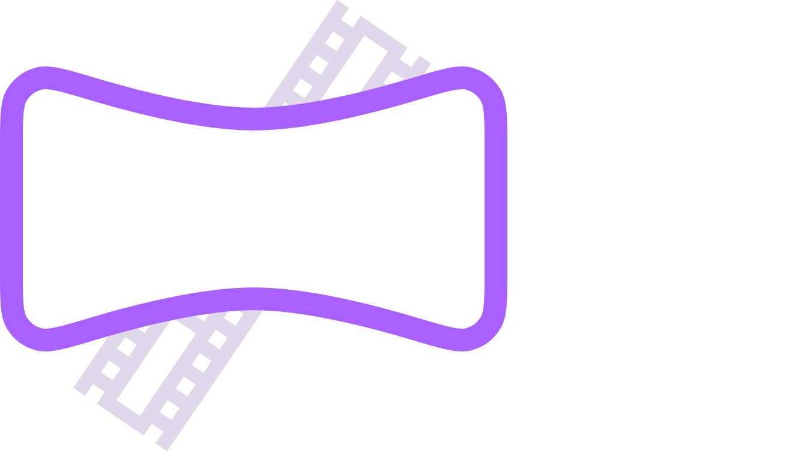
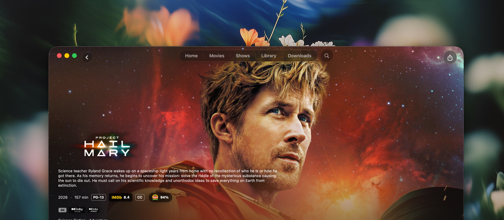
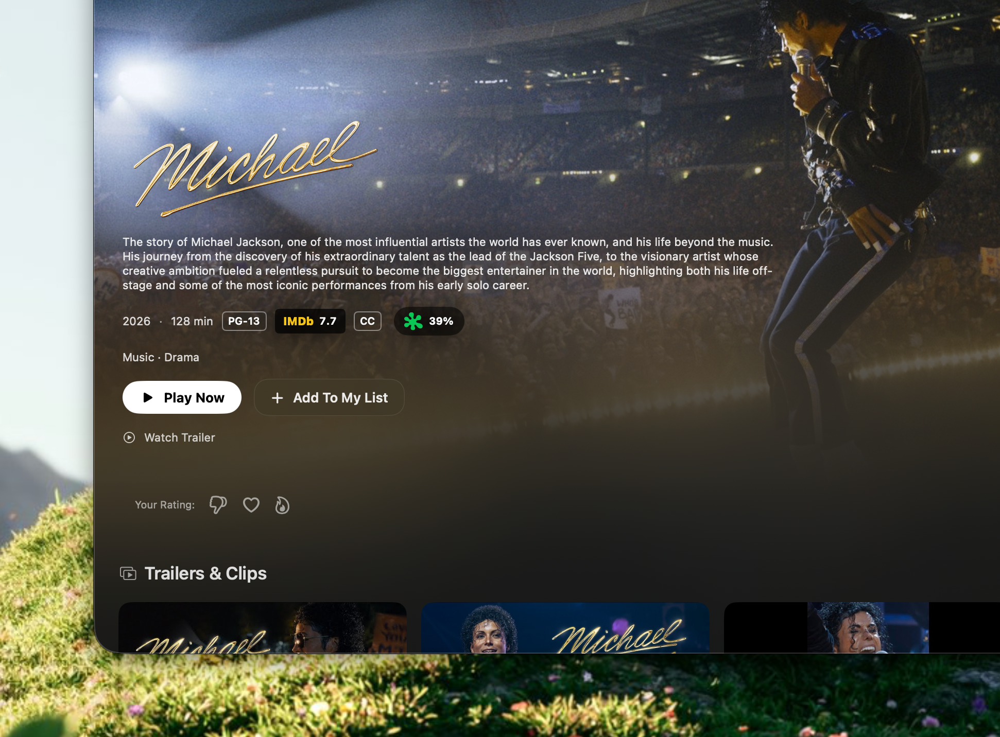

<p align="center">
  
</p>

A native **macOS** app for browsing movies and TV, streaming from torrents, and managing downloads — with a **Cloudflare Worker** backend that proxies metadata, images, subtitles, and torrent indexers so the app never talks to those APIs directly.

<p align="center">
  
</p>

<p align="center">
  
</p>

Think of it as a personal media library: TMDB for discovery, torrent search across several indexers, piece-based streaming with resume, optional full downloads, and a player that can remux MKV into HLS for AVPlayer (including HDR when the source supports it).

> **Note:** The app is open source. Run the **backend yourself** ([guide](docs/SELF_HOSTING.md)) — there is no public hosted API. The maintainer’s Worker is for personal use only. Torrent playback stays on your Mac. Use it responsibly and in line with the laws where you live.

## What’s in the repo

| Path | What it is |
|------|------------|
| [`App/`](App/) | SwiftUI macOS app (`MovieBox.xcodeproj`) and local Swift packages |
| [`Backend/`](Backend/) | Hono API on Cloudflare Workers (Wrangler + Bun) |
| [`PRIVACY.md`](PRIVACY.md) | What the app and backend collect |
| [`docs/SELF_HOSTING.md`](docs/SELF_HOSTING.md) | Run your own backend on Cloudflare Workers |
| [`LICENSE`](LICENSE) | [CC BY-NC-ND 4.0](https://creativecommons.org/licenses/by-nc-nd/4.0/) |

### App packages (high level)

- **MovieBox** — UI, navigation, detail views, downloads list  
- **MovieBoxCore** — playback coordination, settings, persistence, backend sync  
- **CoreStreaming** — torrent pieces, HTTP range server, download manager  
- **CoreTorrent / CoreMetadata** — magnet handling, TMDB/subtitle clients  
- **MoviePlayer** — AVPlayer UI, FFmpeg remux, HLS cache ([package README](App/MoviePlayer/README.md))  
- **CoreStorage / DesignSystem** — SwiftData models, shared UI  

The first Xcode build downloads **static ffmpeg/ffprobe** into the app bundle (see `App/Scripts/embed-ffmpeg-tools.sh`).

## Requirements

- **macOS 26.5+** (matches the app’s deployment target in Xcode)  
- **Xcode** with the matching macOS SDK  
- **[Bun](https://bun.sh)** for the Worker (`Backend/`)  
- API keys: [TMDB](https://www.themoviedb.org/settings/api), [Fanart.tv](https://fanart.tv/get-an-api-key/), and optionally OMDB, SubDL  

## Quick start

### 1. Clone and open the app

```bash
git clone https://github.com/Rahuletto/moviebox.git
cd moviebox/App
open MovieBox.xcodeproj
```

Build and run (**⌘R**). The embed script will fetch ffmpeg on first build if needed.

### 2. Run the backend locally

```bash
cd Backend
cp .dev.vars.example .dev.vars
# Edit .dev.vars — at minimum TMDB_TOKEN, FANART_API_KEY, APP_SECRET
bun install
bun run dev
```

The Worker listens on **http://127.0.0.1:8787**. Health check: `curl http://127.0.0.1:8787/health`.

### 3. Point the app at your Worker

In the app: **Settings → Metadata** (or on first launch in Debug builds, defaults may be applied automatically).

Full production deploy: **[docs/SELF_HOSTING.md](docs/SELF_HOSTING.md)**. Privacy: **[PRIVACY.md](PRIVACY.md)**.

| Setting | Local dev | Production |
|---------|-----------|------------|
| Proxy URL | `http://127.0.0.1:8787` | Your `*.workers.dev` URL after `bun run deploy` |
| Use local backend | On | Off |
| App token | Same as `APP_SECRET` in `.dev.vars` | Same secret on the deployed Worker |

**Debug-only convenience:** copy the app secrets stub so Debug builds can pre-fill the token:

```bash
cp App/MovieBox/Configuration/DevelopmentSecrets.swift.example \
   App/MovieBox/Configuration/DevelopmentSecrets.swift
# Set appToken to the same value as APP_SECRET in Backend/.dev.vars
```

`DevelopmentSecrets.swift` is gitignored — never commit it.

### 4. Deploy the Worker (optional)

```bash
cd Backend
# Configure secrets in Cloudflare (wrangler secret put …) or dashboard
bun run deploy
```

Set the app’s proxy URL to your deployed Worker and turn off “use local backend”.

## Configuration reference

### Backend — `Backend/.dev.vars`

| Variable | Required | Purpose |
|----------|----------|---------|
| `TMDB_TOKEN` | Yes | Movie/TV metadata |
| `FANART_API_KEY` | Yes | Artwork |
| `APP_SECRET` | Yes | Bearer token the macOS app sends (`X-App-Token`) |
| `OMDB_API_KEY` | No | Rotten Tomatoes / OMDb enrichment |
| `SUBDL_API_KEY` | No | SubDL subtitle search |

### Worker scripts

```bash
bun run dev          # local Worker on :8787
bun run deploy       # deploy to Cloudflare
bun run lint:strict  # oxlint, warnings fail CI
bun run smoke:local  # smoke tests against local Worker
bun run cf-typegen   # regenerate worker-configuration.d.ts
```

### App logs

Playback and remux logs (when enabled):  
`~/Library/Logs/MovieBox/moviebox.log`

## Backend API (overview)

All `/api/*` routes expect header `X-MovieBox-Token: <APP_SECRET>` (same value as in app Settings).

| Area | Examples |
|------|----------|
| Health | `GET /health` |
| Metadata | `GET /api/title/:kind/:id`, `GET /api/person/:id` |
| Torrents | `GET /api/torrent/search`, `GET /api/torrent/metadata`, SSE stream search |
| Subtitles | `GET /api/subtitles/search`, `GET /api/subtitles/download` |
| Images | `GET /img?u=…` (allowlisted hosts only) |
| Admin | `POST /api/cache/purge`, `GET /api/status` |

Indexer plugins live under `Backend/src/torrent/`. TMDB paths are proxied and cached in KV (`MOVIEBOX_CACHE` in `wrangler.jsonc`).

## Updates (Sparkle + GitHub Releases)

The macOS app checks for updates via [Sparkle](https://sparkle-project.org/), using an appcast hosted in this repo:

`https://raw.githubusercontent.com/Rahuletto/moviebox/main/appcast.xml`

- **Users:** MovieBox → Settings → General → **Updates**, or the system **MovieBox → Check for Updates** menu item.  
- **Maintainers:** see [docs/RELEASING.md](docs/RELEASING.md) for signing keys, tagging (`v1.0.0`), and the release workflow.

## Development tips

- **Magnet links:** the app registers a URL scheme — opening `magnet:?…` can jump straight into import flow.  
- **Swift packages:** you can build modules in isolation, e.g. `swift build --package-path App/CoreStreaming`.  
- **Player package:** see [App/MoviePlayer/README.md](App/MoviePlayer/README.md) for remux tiers, HDR checks, and integration notes.  
- **CI:** if workflows are enabled on your branch, Swift builds need a stub secrets file (the workflow copies `DevelopmentSecrets.swift.example`); backend CI runs `bun run lint:strict`. Trigger workflows manually: `./scripts/gh-workflow.sh build` or `./scripts/gh-workflow.sh release 1.0.0` (see [docs/RELEASING.md](docs/RELEASING.md)).

## Support

If MovieBox is useful to you, you can sponsor development on GitHub — no paid tier, no hosted backend:

**[github.com/sponsors/Rahuletto](https://github.com/sponsors/Rahuletto)**

That helps cover API keys and Cloudflare costs for the maintainer’s personal setup. Everyone else should [self-host](docs/SELF_HOSTING.md).

## License

This project is licensed under **Creative Commons Attribution-NonCommercial-NoDerivatives 4.0 International** ([full text](LICENSE)).

- You may view and use the code for **non-commercial** purposes with attribution.  
- **No derivatives** — you may not share adapted versions (forks that change and redistribute the codebase may not be allowed under this license; read the license if unsure).  

## Contributing

Issues and discussion are welcome. Because of **BY-NC-ND**, please don’t open PRs that expect merged derivative work without checking the license first. Security reports: see [SECURITY.md](SECURITY.md) (update contact details there if you maintain a public fork).

---

Built for macOS with SwiftUI, SwiftData, AVPlayer, FFmpeg, Hono, and Cloudflare Workers.
